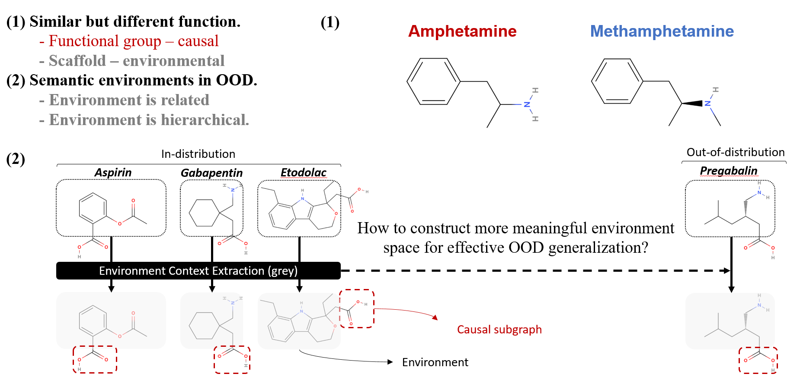
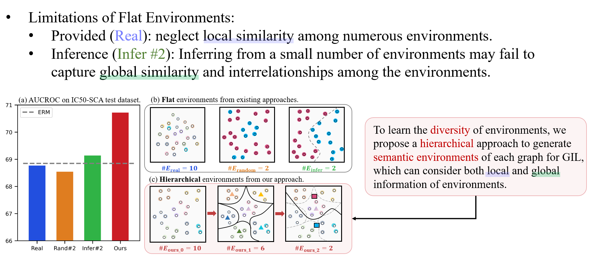
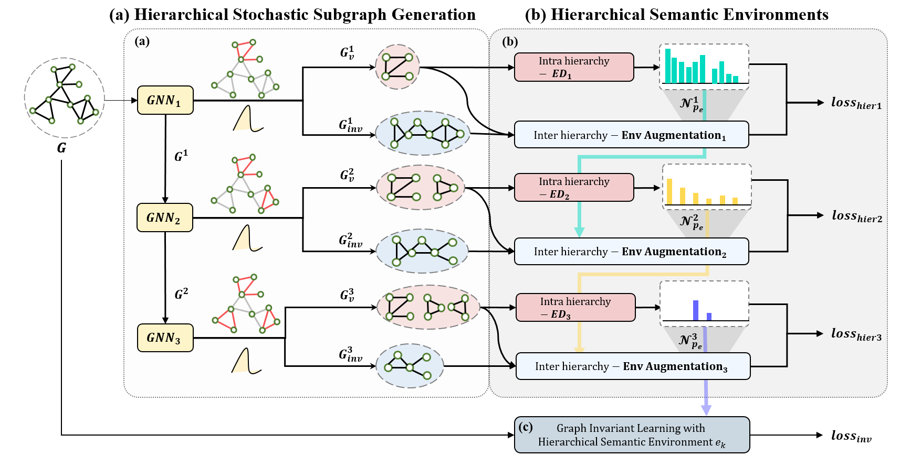

<h1 align="center">Improving out-of-distribution generalization in graphs via hierarchical semantic environments</h1>
<p align="center">
    <a href="https://arxiv.org/abs/2403.01773"></a>
    <a href="https://github.com/qkrdmsghk/GOODHSE"></a>
    <!-- <a href="https://colab.research.google.com/drive/1t0_4BxEJ0XncyYvn_VyEQhxwNMvtSUNx?usp=sharing"></a> -->
    <!-- <a href="https://openreview.net/forum?id=A6AFK_JwrIW">  </a> -->
    <!-- <a href="https://github.com/LFhase/CIGA/blob/main/LICENSE">  </a> -->
    <!-- <a href="https://neurips.cc/virtual/2022/poster/54643"> </a> -->
    <!-- <a href="https://lfhase.win/files/slides/CIGA.pdf"> </a> -->
   <!--  <a href="https://icml.cc/media/PosterPDFs/ICML%202022/a8acc28734d4fe90ea24353d901ae678.png"> </a> -->
</p>

## Motivation
The complex nature of molecule graphs poses unique challenges to out-of-distribution (OOD) generalization, differentiating them from images and general graphs:

1. Molecules with Similar Structures Can Have Different Functions:
- Functional Group: Acts as a causal subgraph.
- Scaffold: Serves as an environmental (noise) subgraph.

2. Semantic Environments in OOD:
- Environments are related.
- Environments are hierarchical.
<p align="center"></p>
<p align="center"><em>Figure 1.</em> Challenges on molecule graphs in out-of-distribution setting.</p>

## Challenges
Existing methods use flat enviornments to conduct the graph invariant learning.
There are two limitations in flat environment infernece:
1. Provided (Real): neglect local similarity among the numerous environments.
2. Inference (Infer #2): Inferring from a small number of environments may fail to capture global similarity and interrelationships among the environments. 
<p align="center"></p>
<p align="center"><em>Figure 2.</em> (a) Results on IC50-SCA dataset from DrugOOD. (b) Flat environments from existing approaches. (c) Hierarchical environments from our methods. For visualization, we set #real environments as 10.</p>

## Instructions
<p align="center"></p>
<p align="center"><em>Figure 3.</em>Our Framework consists of (a) Hierarchical Stochastic Subgraph Generation, (b) Hierarchical Semantic Environments, (c) Robust GIL with Hierarchical Semantic Environments.</p>

### Installation and data preparation
Our code is based on the following libraries:

```
torch==1.9.0+cu111
torch-geometric==2.0.2
```

plus the [DrugOOD](https://github.com/tencent-ailab/DrugOOD) benchmark repo.

The data used in the paper can be obtained following these [instructions](./dataset_gen/README.md).

### Reproduce results
We provide the hyperparamter tuning and evaluation details in the paper and appendix.
In the below we give a brief introduction of the commands and their usage in our code. 
We provide the corresponding running scripts in the [script](./scripts/) folder.

Simply run 
```
bash run.sh 0 icassay
```
with corresponding datasets and model specifications.


<!-- Runing with CIGA:
- `--ginv_opt` specifies the interpretable GNN architectures, which can be `asap` or `gib` to test with ASAP or GIB respectively.
- `--r` is also needed for interpretable GNN architectures that specify the interpretable ratio, i.e., the size of $G_c$.
- `--c_rep` controls the inputs of the contrastive learning, e.g., the graph representations from the featurizer or from the classifier
- `--c_in` controls the inputs to the classifier, e.g., the original graph features or the features from the featurizer
- To test with CIGAv1, simply specify `--ginv_opt` as default, and `--contrast` a value larger than `0`.
- While for CIGAv2, additionally specify `--spu_coe` to include the other objective.
- `--s_rep` controls the inputs for maximizing $I(\hat{G_s};Y)$, e.g., the graph representation of $\hat{G_s}$ from the classifier or the featurizer. -->

<!-- Running with the baselines:
- To test with DIR, simply specify `--ginv_opt` as default and `--dir` a value larger than `0`.
- To test with invariant learning baselines, specify `--num_envs=2` and
use `--irm_opt` to be `irm`, `vrex`, `eiil` or `ib-irm` to specify the methods,
and `--irm_p` to specify the penalty weights. -->

<!-- Due to the additional dependence of an ERM reference model in CNC, we need to train an ERM model and save it first,
and then load the model to generate ERM predictions for positive/negative pairs sampling in CNC. 
Here is a simplistic example: -->
<!-- ```
python main.py --erm --contrast 0 --save_model
python main.py --erm --contrast 1  -c_sam 'cnc'
``` -->

<!-- ## Misc
As discussed in the paper that the current code is merely a prototypical implementation based on an interpretable GNN architecture, i.e., [GAE](https://arxiv.org/abs/1611.07308), in fact there could be more implementation choices:
- For the architectures: CIGA can also be implemented via [GIB](https://github.com/Samyu0304/Improving-Subgraph-Recognition-with-Variation-Graph-Information-Bottleneck-VGIB-) and [GSAT](https://github.com/Graph-COM/GSAT). 
- For the hyperparameter tunning: You may find plentiful literature from [multi-task learning](https://github.com/median-research-group/LibMTL), or try out [PAIR](https://arxiv.org/abs/2206.07766).
- Besides, CIGA is also compatible with state-of-the-art contrastive augmentations for graph learning, which you may find useful information from [PyGCL](https://github.com/PyGCL/PyGCL).

You can also find more discussions on the limitations and future works in Appendix B of our paper.

That being said, CIGA is definitely not the ultimate solution and it intrinsically has many limitations. 
Nevertheless, we hope the causal analysis and the inspired solution in CIGA could serve as an initial step towards more reliable graph learning algorithms that are able to generalize various OOD graphs from the real world. -->


<!-- If you find our paper and repo useful, please cite our paper: -->

<!-- ```bibtex
@InProceedings{chen2022ciga,
  title       = {Learning Causally Invariant Representations for Out-of-Distribution Generalization on Graphs},
  author      = {Yongqiang Chen and Yonggang Zhang and Yatao Bian and Han Yang and Kaili Ma and Binghui Xie and Tongliang Liu and Bo Han and James Cheng},
  booktitle   = {Advances in Neural Information Processing Systems},
  year        = {2022}
}
``` -->

Ack: The readme is inspired by [CIGA](https://github.com/LFhase/CIGA). 😄
